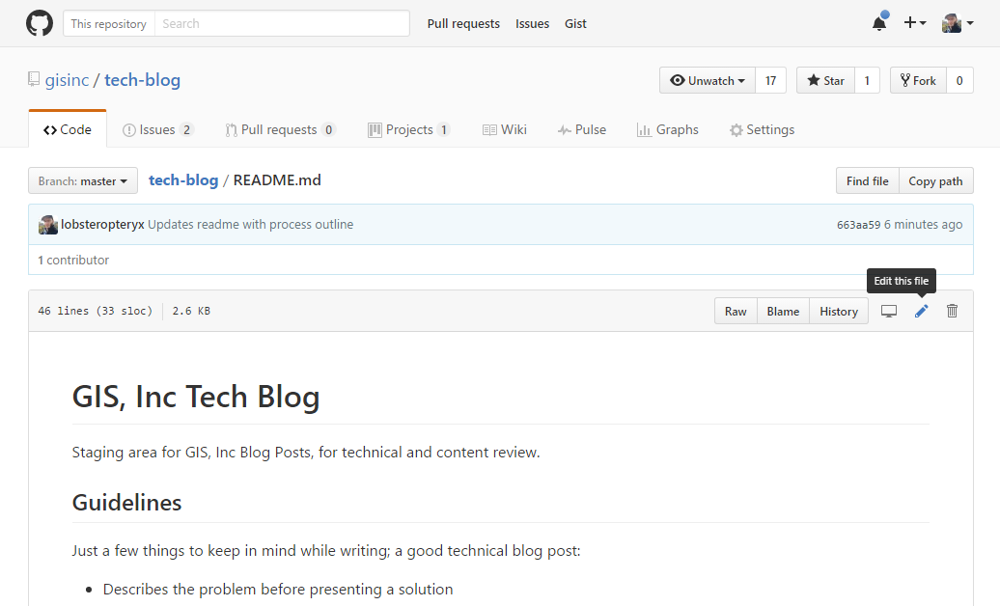

# GIS, Inc Tech Blog
Staging area for GIS, Inc Blog Posts, for technical and content review.

## Guidelines
Just a few things to keep in mind while writing; a good technical blog post:

* Describes the problem before presenting a solution 
* Solves a problem 
* Explains how to do something 
* Is concise and to the point 
* Is something you might be happy to see in a list of search results 
* Can be boiled down to a one or two sentence summary, and still sound like something you'd read 
* Hasn't already been written (how long did you spend searching for an answer?) 
* Is fun (funny) to read.

## Workflow
Posts will be published every other Tuesday, and we'll schedule folks to write articles the month before.  The worflow will be something like:

### Authoring
By the end of the *month before* your target publish date:

* Sign up by adding your name and topic to the [schedule](https://gisinc.sharepoint.com/sites/techblog/_layouts/15/WopiFrame.aspx?sourcedoc=%7B0400897D-54DE-47E4-A253-F6A64DF244C0%7D&file=Topics%20and%20Schedule.xlsx&action=default&IsList=1&ListId=%7BFE5A177B-935B-421B-A744-33C3AA803889%7D&ListItemId=1)
* Double check with your supervisor to get time allocated

By the end of the *week before* your target publish date:

* Write your article :)
* Post it to github
* Create a new issue with the article title and the appropriate label ("In Progress" or "In Review")
* If you like, create a new [project card](https://github.com/gisinc/tech-blog/projects/1) to track the article's progress; don't forget to add a label and assign it to yourself!
* Once your article is complete, let others know that it is ready for review
* Once your article has been reviewed, let marketing know that it is ready for publication

### Reviewing
Once an article is marked as "In Review" by the author, we rely on peer review to help vet technical content and catch grammatical errors.  When reviewing an article,

* For grammatical changes, either
  * Edit the article directly in github
  * Make a comment on the [issue thread](https://github.com/gisinc/tech-blog/issues) for that article, or
  * Submit a pull request with corrections
* For content suggestions, make a comment on the issue thread for the article
* If you review an article and everything looks good, please make a note in the issue thread!

## Format
Plain text (i.e., markdown) is the easiest to work with, but don't let that be a blocker!  If you're more comfortable using a word doc or anything else, go for it.

## Tips
If you're interested in learning about development workflows, writing a post in markdown and using git is a great way to get started, as is reviewing and submitting a pull request with changes.  If you need help getting your post into the repo, just ask!

Note that you can edit documents in your browser--this is especially useful for making minor corrections, but you can also use it to write a post if you prefer.

