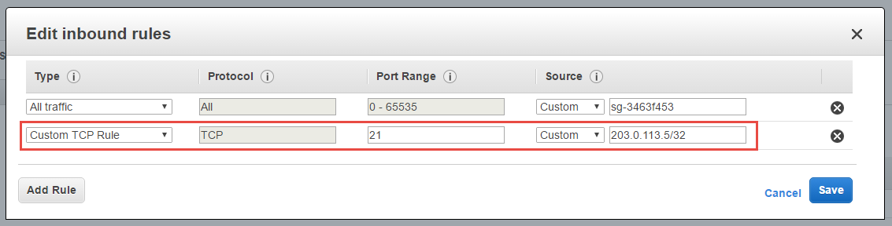

# Getting Data up to Amazon Web Services
    
So, you have yourself a shiny new Windows Elastic Cloud 
Compute (EC2) instance on Amazon Web Services 
(AWS). Chances are, you need to get some data up there, 
maybe a library of images, or PDFs you plan to serve up, or 
maybe a 50GB database backup that you need to restore. 
Maybe you need to get data up there routinely as some sort 
of an update process. Whatever the case, there are plenty 
of ways to get your data up to your EC2 instance. Here at 
GISinc, we deploy ArcGIS Server on AWS EC2 instances routinely 
and always have a need to get data up to the server. 
Sometimes it's a one-shot upload (a database backup for 
restore, perhaps), but most of the time we need to setup 
an automated update process to get production data from 
a client environment up their AWS server for publication. 
The following is a breakdown of some of the ways we have 
pushed data up to AWS, and following that are some other 
methods Amazon has available for larger data transfers.

**Please note that the following is not an attempt at a 
complete list of ways to get data up to AWS. It is the 
readers responsibility to read the AWS documentation 
carefully regarding costs related to data storage and 
transfer.**

## Commonplace methodologies

### Copy/paste

When you connect to your EC2 instance through RDP, 
there's always copy/paste for simple one-off data 
tranfers. This goes for any Remote Desktop connection, 
and is oftentimes the quickest, cleanest, and 
easiest way to manually get data from one place to 
another.

### FTP

FTP can be setup relatively easily on a Windows 
Server instance. Although a little old school, FTP 
is still a solid method for transferring MB-scale 
data across networks. FTP can also easily scripted 
with Python and the `ftplib` module from the 
standard library. In it's simpliest form, that 
would look like the following:

```python
link = ftplib.FTP(ftp_server,
                  ftp_user,
                  ftp_pass)
link.set_pasv(True)
with open(r"C:\temp\my-file.txt", "rb") as z:
    link.storbinary('STOR {0}'.format("my-file.txt"), z)
link.close()
```

Although standard FTP is not secure, with AWS, 
you can restrict port access to only a certain 
IP address or a range of IPs, thus providing 
some level of security. Here, using CIDR notation, 
we have specified a range of IP addresses that 
can access port 21:



One of the key upsides to using FTP is that you 
are able to put/get files directly to/from your 
Windows server. Costs for FTP are based on your 
storage needs on your EC2 instance of the data 
you are uploading. Data tranfer in to Amazon EC2 
from the Internet is free. These factors make 
FTP a simple and effective option if you need 
to only routinely automate data tranfer to/from 
an AWS EC2 instance.

## AWS-specific transfer methods

### S3

An alternative to using FTP to push data directly 
to/from your AWS Windows server is to use Amazon 
Simple Storage Service ([S3](https://aws.amazon.com/s3/)) object storage as a 
interim storage medium. With this method you upload 
data to S3, then download the data to your EC2 
instance. S3 supports data transfer over SSL and 
automatically encrypts your data once it is uploaded. 
Here at GISinc, we love Python, and 
[Boto](https://boto3.readthedocs.io/en/stable/index.html) 
is the defacto AWS SDK for Python. Boto makes it 
incredibly easy and simple to interact with Amazon 
services like S3. Uploading a file to S3 is as 
simple as creating a connection to your S3 bucket, 
getting a reference to your local file, and 
uploading it.

```python
import boto3

s3 = boto3.resource("s3")
bucket = s3.Bucket("my-org-my-bucket")
# Local file to upload
obj = bucket.Object(r"C:\temp\my-file.txt")
obj.upload_file(object)
```

Downloading from an S3 bucket is equally simple.

```python
import boto3

s3 = boto3.resource("s3")
bucket = s3.Bucket(bucket_name)
# S3 file to download
obj = bucket.Object(os.path.basename("my-other-file.txt"))
obj.download_file(r"C:\temp\my-other-file.txt")
```

With S3, you pay for only the storage you use, 
with no minimum fee. S3 storage pricing is very 
affordable, with current US East Region Standard 
Storage being pennies per GB for the first TB 
per month.  Associated request pricing is $0.005 
per 1,000 requests. Data tranfer in to S3 is 
free, with data transfer out costs varying 
depending on the destination.

Scriptability, low cost, security, simplicity, 
and availability all make S3 an excellent way 
to get MB- to GB-scale data to and from 
your AWS EC2 instance.

## AWS large-scale data transfer methods

We have demonstrated that both FTP and S3 transfer 
will work nicely for MB- to GB-scale transfers, 
but what do you do when you need to transfer 
data on the order of terabytes?

### Import/Export

[AWS Import/Export](http://docs.aws.amazon.com/AWSImportExport/latest/DG/whatisdisk.html) 
is a good choice if you have 16TB or less of data 
you need to get up to AWS. With Import/Export, you 
supply the external hard drive loaded with your data, 
ship it to Amazon, and within one business day of 
arrival at AWS, your data will get transferred to 
a S3 bucket or EBS volume, ready for you to use. 
It's pretty easy to see that for large datasets, 
Import/Export is substantially faster than Internet 
transfer, and in the end will more than likely 
consume less project hours to complete a transfer 
task as well.

We recently used Import/Export to get a 900GB 
imagery library into an EBS volume for 
disaster recovery purposes for a client. The 
process took 2.5 weeks from idea to finish 
(using standard ground shipping to get the 
hard drive about 3/4 of the way across the 
continental U.S.), cost around $150 for materials 
(1TB drive) and Import/Export services, and 
took less than 15 personnel hours to complete. 
We estimated that it would have taken several 
weeks, many more project hours, and much more 
stress to upload the data using scripts.

### Snowball

[AWS Snowball](https://aws.amazon.com/snowball/) 
is a petabyte-scale data transport solution that 
utilizes secure data storage appliances shipped to 
you from AWS. You attach the appliance to your 
network and the Snowball client encrypts and 
transfers the data to the appliance at high 
speed. After transfer to AWS, your data is moved 
to S3. Common use cases for Snowball are 
cloud migration, disaster recovery, datacenter 
decommission, or anytime you need to get 
massive amounts of data to or from AWS.

### Snowmobile

In 2016, AWS introduced AWS [Snowmobile](https://aws.amazon.com/snowmobile/), an 
exabyte-scale data transfer service that is 
literally a 45-foot long 100PB capable 
ruggedized shipping container pulled by a 
tractor-trailer truck. Snowmobile is massively 
scalable, secure, rugged, durable, and 
customizable. With Snowmobile, extremely large 
data tranfers on the scale of hundreds of 
petabytes that could take tens of years 
to tranfer over the Internet are now possible 
in weeks.

## Conclusion

Depending on your needs, you have options 
when it comes to getting data up to your 
AWS EC2 instance. Copy/paste, FTP, S3, and AWS 
Import/Export are relatively easy methods to 
employ. In this article, we discussed Windows 
instances, but all of these methods could also 
be employed on other operating systems as well.
