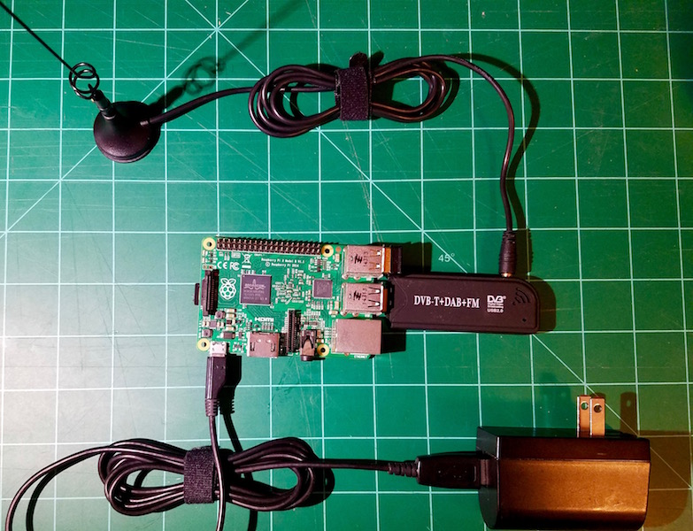
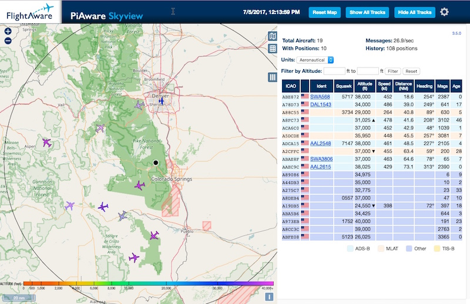

Have you ever looked up at a plane flying overhead and wondered what type of aircraft it was or where it was heading?   While there are a myriad of web and smart phone application to answer these questions for you, wouldn't it be nice to be able to capture the information directly from the airways using equipment you set up at your home?   If you've answered yes to these questions and are comfortable configuring hardware and installing software, then continue to read on to learn about an inexpensive way to do this from your home.

In order to get started with this project we need to take a quick sidetrip on the technology that makes all this possible.  The first is the ADS-B signals sent out by the aircraft.  ADS-B stands for [Automatic Dependent Surveillance - Broadcast](https://en.wikipedia.org/wiki/Automatic_dependent_surveillance_%E2%80%93_broadcast#Description).  This signal is broadcast by most aircraft and contains information about the aircraft's speed, heading, altitude, location and identity, and is used to help avoid collisions and provide situational awareness beyond the current Air Traffic Control systems.  The second technology we will leverage for this application is Software Defined Radio (SDR).  Simply put, an SDR is a cheap and inexpensive piece of hardware you can purchase that when coupled with a computer acts, as a radio receiver.  The best place to read up on this is the site [RTL-SDR.COM](http://www.rtl-sdr.com/about-rtl-sdr/).  The final bit of tech we will be using is the [RaspBerry Pi](https://www.raspberrypi.org/help/faqs/#introWhatIs) - an inexpensive microcomputer that the system will run on.

Now that we know what technology is used to make this application run, here is a quick list of the hardware needed to be acquired.   All can be purchased for around $75 from online sites, so I will leave it up to you to decide where to buy it from.

1. Raspberry Pi:  Recommend version 3 as it has built in wifi, but version 2 will also work
2. RTL-SDR:  Any of the RTL-SDR DVB-T usb sticks will work
3. Micro SD Card:  8GB or larger

With the hardware in hand, it is a pretty straight forward process to get everything setup.  The first thing you will need to decide is how indepth do you want to go with building your system.   For this activity, I'm going to recommend we take the easiest route that gets us up and running in the shortest amount of time.   For those so inclined to going down rough road, I recommend reading about all the possibilities on the [RTL-SDR ADS-B page](http://www.rtl-sdr.com/adsb-aircraft-radar-with-rtl-sdr/).   

To get the software installed and running on our RasPi, [FlightAware](http://flightaware.com) has gone ahead and done all the heavy lifting and created an image file that contains the operating and software needed to run the aircraft tracking application.  They've done this to make it easy to increase the coverage of receivers listening to aircraft, with the understanding that what your station is picking up is resent to their service.  If you are uncomfortable with sending data from your home up to FlightAware...... recommend following the other path to getting the softare installed and running.   Here is a quick breakdown of the steps to take, with detailed information found on the [FlightAware build page](http://flightaware.com/adsb/piaware/build)

1. Download the PiAware RasPi image and install it on the SD Card
2. Configure the application for your network or the type of receiver you are using if necessary
3. Install the SD card on the RasPi, connect the RTL-SDR usb device and antenna, and then plug it in.

Once it has started up, you can view the signals being received by the device by opening the application in a web browser on your local network.  The web address will be http://raspi-ip-address/dump1090-fa/

